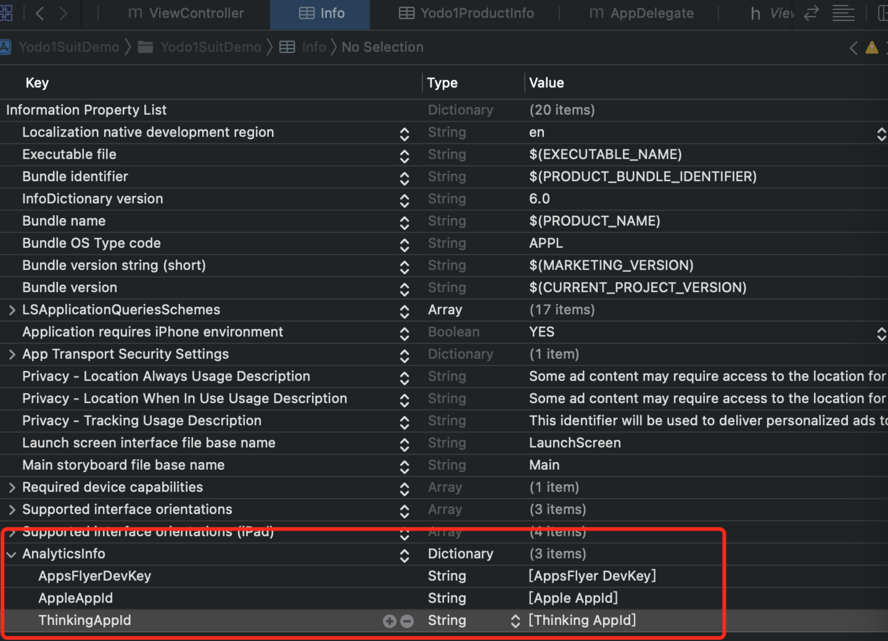

# iOS集成

**开始之前**:
>* `iOS14`要求`Xcode`版本为`12+`，请务必升级您的`Xcode`版本到`12+`。
>*  `SDK`要求`iOS`的最低版本为`iOS10.0`
>*  最简便的方法就是使用`CocoaPods`(请使用`1.10`及以上版本), 如果您刚开始接触`CocoaPods`，请参阅其[官方文档](https://guides.cocoapods.org/using/using-cocoapods)，了解如何创建和使用`Podfile`

## 集成步骤
### 1. 将`iOS SDK`添加到项目中
#### 1.1 创建`Podfile`文件</br>
在项目根目录下创建`Podfile`文件
```ruby
touch Podfile
```

#### 1.2 将iOS SDK导入项目</br>
请打开项目的 `Podfile` 文件并将下面代码添加到应用的目标中：

```ruby
source 'https://github.com/Yodo1Games/Yodo1Spec.git'
source 'https://github.com/CocoaPods/Specs.git'

pod 'Yodo1Suit/Yodo1_ConfigKey', '1.5.1.1'
pod 'Yodo1Suit/OpenSuit_AnalyticsAppsFlyer', '1.5.1.1'
pod 'Yodo1Suit/OpenSuit_AnalyticsUmeng', '1.5.1.1'
pod 'Yodo1Suit/Yodo1_UCenter', '1.5.1.1'

```

在`终端`中执行如下命令：</br>
```ruby
pod install --repo-update
```

### 2. `Xcode`工程配置
#### 2.1 设置`Yodo1KeyInfo.plist`参数
``` xml
<key>KeyConfig</key> 
	<dict> 
   	 	<key>AppsFlyer_domain</key> 
    		<string>[AppsFlyer domain]</string> 
    	<key>ThinkingAppId</key> 
    		<string>[ThinkingData AppId]</string> 
    	<key>AppsFlyer_Schemes</key> 
    		<string>[AppsFlyer Schemes]</string> 
    	<key>ThinkingServerUrl</key> 
    		<string>[Thinking ServerUrl]</string> 
    	<key>AppsFlyer_Identifier</key> 
    		<string>[[AppsFlyer Identifier]</string> 
    	<key>SdkVersion</key> 
    		<string>1.5.1.1</string> 
    	<key>GameKey</key> 
    		<string>[Yodo1 GameKey]</string> 
    	<key>debugEnabled</key> 
   	 		<string>0</string> 
    	<key>RegionCode</key> 
    		<string>[Yodo1 RegionCode]</string> 
    	<key>UmengAnalytics</key> 
    		<string>[Umeng AppId]</string> 
    	<key>AppleAppId</key> 
    		<string>[Apple AppId]</string> 
    	<key>AppsFlyerDevKey</key> 
    		<string>[AppsFlyer DevKey]</string> 
</dict>
```

#### 2.2 `iOS9 App Transport Security`设置
在`iOS9`中，苹果增加了关于`ATS`的控制。为了确保在所有中介网络上不间断地支持MAS广告，需要您在`Info.plist`文件中进行以下设置：

* 添加`NSAppTransportSecurity`，类型为`Dictionary`
* 在`NSAppTransportSecurity`中添加`NSAllowsArbitraryLoads`，类型为`Boolean`，值为`YES`

你也可以直接编辑plist源码(`Open As Source Code`)实现同样的功能，示例如下：
        
``` xml
<key>NSAppTransportSecurity</key> 
	<dict> 
   	 	<key>NSAppTransportSecurity</key> 
    		<true/>
</dict>
```

#### 2.3 禁用`BitCode`
为确保所有中介网络正常工作，请禁用bitcode，如下图所示:


### 3. 遵守必要的法律框架(Privacy)
请遵守适用于您的游戏及其用户的所有法律框架。

<font color=red>重要：</font>不遵守这些框架可能会导致苹果商店拒绝你的游戏，并对你的游戏盈利产生负面影响。
#### 3.1 导入头文件`Yodo1Suit.h``YD1AgePrivacyManager.h`
``` obj-c
#import "YodoSuit.h"
#import "YD1AgePrivacyManager.h"
```
#### 3.2 Privacy设置
``` obj-c
//CCPA Publishers may choose to display a "Do Not Sell My Personal Information" link.
//true is age < limitAge.
[Yodo1Suit setDoNotSell:NO];

//COPPA To ensure COPPA, GDPR, and AppStore policy compliance, you should indicate whether a user is a child.
//true, If the user is known to be in an age-restricted category (i.e., under the age of 13), false otherwise.
[Yodo1Suit setTagForUnderAgeOfConsent:NO];

//GDPR YES, If the user has consented, NO otherwise.
//YES is age >= limitAge
[Yodo1Suit setUserConsent:NO];
```

``` obj-c
/**
 *  如果没有其他方案提供协议标记，则通过sdk sdk协议展示交互来获取到协议标记。
 */
[YD1AgePrivacyManager dialogShowUserConsentWithGameAppKey:@"Your AppKey" channelCode:@"appstore" viewController:self block:^(BOOL accept, BOOL child, int age) {

 }];
```
### 4. 初始化SDK
#### 4.1 导入头文件`Yodo1Suit.h`
``` obj-c
#import "YodoSuit.h"
```

#### 4.2 在 didFinishLaunchingWithOptions 中进行初始化 
``` obj-c
[YodoSuit initWithAppKey:@"Your AppKey"];
```

### 5. 数据分析(可选)
#### 5.1 导入头文件`Yodo1AnalyticsManager.h`
``` obj-c
#import "Yodo1AnalyticsManager.h"
```
#### 5.2 上报自定义事件
``` obj-c
/**
 *  @param eventName  事件id(必须)
 *  @param eventData  事件数据(可选)
 */
- (void)eventAnalytics:(NSString*)eventName
             eventData:(NSDictionary*)eventData;
```

#### 5.3 AppsFlyer相关事件

``` obj-c
/**
 *  使用appsflyer 自定义事件
 *  @param eventName  事件id(必须)
 *  @param eventData  事件数据(可选)
 */
- (void)eventAdAnalyticsWithName:(NSString *)eventName 
                       eventData:(NSDictionary *)eventData;
```

``` obj-c
/**
 *  AppsFlyer Apple 内付费验证和事件统计
 */
- (void)validateAndTrackInAppPurchase:(NSString*)productIdentifier
                                price:(NSString*)price
                             currency:(NSString*)currency
                        transactionId:(NSString*)transactionId;
```

``` obj-c
/**
 *  订阅openURL(AppsFlyer-Deeplink])
 *
 *  @param application  生命周期中的application
 *  @param url                    生命周期中的openurl
 *  @param options           生命周期中的options
 */
- (void)SubApplication:(UIApplication *)application openURL:(NSURL *)url options:(NSDictionary<UIApplicationOpenURLOptionsKey, id> *)options;
```

``` obj-c
/**
 *  订阅continueUserActivity(AppsFlyer-Deeplink])
 *
 *  @param application                      生命周期中的application
 *  @param userActivity                    生命周期中的userActivity
 *  @param restorationHandler       生命周期中的restorationHandler
 */
- (void)SubApplication:(UIApplication *)application continueUserActivity:(nonnull NSUserActivity *)userActivity restorationHandler:(nonnull void (^)(NSArray<id<UIUserActivityRestoring>> * _Nullable))restorationHandler;
```

### 6. 应用程序内购

#### 6.1 准备计费点`Yodo1ProductInfo.plist`
``` xml
<key>custom name</key> 
	<dict> 
   	 	<key>ProductName</key> 
    		<string>产品名称</string> 
    	<key>ChannelProductId</key> 
    		<string>产品id</string> 
    	<key>ProductDescription</key> 
    		<string>产品描述</string> 
    	<key>PriceDisplay</key> 
    		<string>显示的价格</string> 
    	<key>ProductPrice</key> 
    		<string>产品价格</string> 
    	<key>Currency</key> 
    		<string>货币</string> 
    	<key>ProductType</key> 
    		<string>产品类型</string> 
    	<key>PeriodUnit</key> 
   	 		<string>时间单位</string> 
</dict>
```


#### 6.2 导入头文件`Yd1UCenterManager.h`
``` obj-c
#import "Yd1UCenterManager.h"
```
#### 6.3 购买产品
``` obj-c
/**
 * 购买产品
 * extra 是字典json字符串 @{@"channelUserid":@""}(非必须)
 */
- (void)paymentWithUniformProductId:(NSString *)uniformProductId
                              extra:(NSString*)extra
                           callback:(PaymentCallback)callback;
```
#### 6.4 恢复购买
```obj-c
/**
 *  恢复购买
 */
- (void)restorePayment:(RestoreCallback)callback;
```
#### 6.5 查询漏单

```obj-c
/**
 *  查询漏单
 */
- (void)queryLossOrder:(LossOrderCallback)callback;
```
#### 6.6 查询订阅

```obj-c
/**
 *  查询订阅
 */
- (void)querySubscriptions:(BOOL)excludeOldTransactions
                  callback:(QuerySubscriptionCallback)callback;
```
#### 6.7 获取产品信息

```obj-c
/**
 *  获取某个产品信息
 */
- (void)productWithUniformProductId:(NSString*)uniformProductId
                           callback:(ProductsInfoCallback)callback;
``` 
```obj-c                        
/**
 *  获取所有产品信息
 */
- (void)products:(ProductsInfoCallback)callback;
```
### 7. 应用程序内购发货通知
#### 7.1 导入头文件`Yd1UCenter.h`
``` obj-c
#import "Yd1UCenter.h"
```
#### 7.2 发货
```obj-c
/**
 *  通知已发货成功
 */
- (void)sendGoodsOver:(NSString *)orderIds
             callback:(void (^)(BOOL success,NSString* error))callback;
```
```obj-c
/**
 *  通知已发货失败
 */
- (void)sendGoodsOverForFault:(NSString *)orderIds
                     callback:(void (^)(BOOL success,NSString* error))callback;
```


